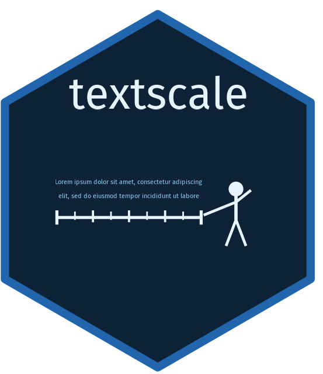

# textscale 

<!-- badges: start -->
<!-- badges: end -->

textscale measures latent quantities from text — things like ideological
tone, argument persuasiveness, or ad negativity — by combining pairwise
comparisons with text embeddings. You provide a collection of documents
and a question (e.g., *"Which ad is more negative?"*). An LLM annotates
a sample of document pairs. textscale then fits a ridge logistic
regression on embedding differences to identify the latent dimension, and
uses it to score any document — including ones never directly compared.

## Installation

```r
# install.packages("pak")
pak::pak("joeornstein/textscale")
```

textscale uses [ellmer](https://ellmer.tidyverse.org/) for LLM calls and
[fuzzylink](https://github.com/joeornstein/fuzzylink) for embeddings. Both
require an OpenAI API key.

## API Key Setup

To install your key in `.Renviron` for use across sessions, run:

```r
fuzzylink::openai_api_key("your-key-here", install = TRUE)
readRenviron("~/.Renviron")  # reload so the key is available immediately
```

You can get a key at [platform.openai.com](https://platform.openai.com/api-keys).
To verify it's set: `Sys.getenv("OPENAI_API_KEY")`.

Scoring image documents (`document_type = "image"` in `textscale()`) also
requires an [OpenRouter](https://openrouter.ai/) API key, set as
`OPENROUTER_API_KEY`, used to retrieve multimodal embeddings. Add it to
`.Renviron` the same way:

```r
Sys.setenv(OPENROUTER_API_KEY = "your-key-here")  # or add directly to .Renviron
```

## Usage

```r
library(textscale)

result <- textscale(
  documents = docs,
  prompt    = "Which political ad is more negative toward its opponent?",
  seed      = 42
)
#> textscale result
#>   Documents scored:  500
#>   Validation:        85.0% accuracy on 5,000 test pairs (ICI = 0.042)

# Document scores with 95% confidence intervals
result$scores

# Calibration plot
plot(result)
```

See the [Measuring Political Ad Tone](https://joeornstein.github.io/textscale/articles/ad-tone.html)
vignette for a worked example using the Carlson & Montgomery (2017) Wisconsin
ads dataset.

`textscale()` handles the full pipeline: generating pairwise comparisons,
retrieving embeddings, annotating pairs via the OpenAI Batch API, fitting
and validating a model on a held-out test split, refitting on all
comparisons, and returning scores for every document.

The individual pipeline steps are also exported if you need finer control:

| Function | Purpose |
|----------|---------|
| `generate_comparisons()` | Create train/test comparison pairs |
| `get_embeddings()` | Retrieve text embeddings |
| `annotate_comparisons()` | Annotate pairs with an LLM |
| `fit_model()` | Fit or refit the model |
| `validate_model()` | Evaluate accuracy on held-out test pairs |
| `score_documents()` | Score documents on the latent dimension |

## How it works

For each annotated pair, textscale computes the difference between the
two document embeddings and labels it 1 if document A won and 0 if B won.
A ridge logistic regression fit on these differences identifies a
direction in embedding space that best separates winners from losers —
that direction is the latent dimension. Projecting any document's
embedding onto this direction gives its score, making it straightforward
to scale new documents without any additional LLM calls.

## Citation

If you use textscale in published research, please cite:

> Ornstein, Joseph T. (2026). *textscale: Measure Latent Quantities from
> Text Using Pairwise Comparisons*. R package version 0.0.0.9000.
