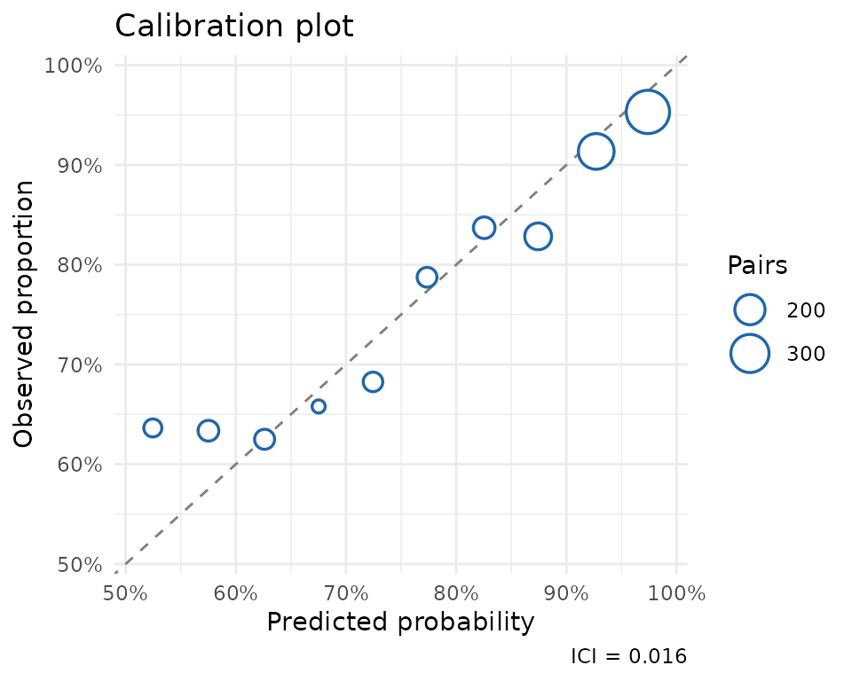
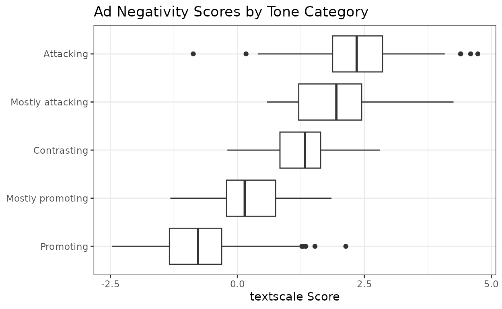
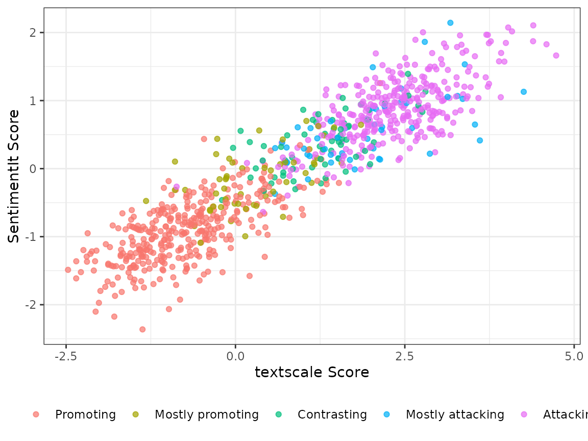

# Measuring Political Ad Tone

Political scientists often need to measure latent quantities from text —
concepts like negativity, ideology, argument strength, etc. Carlson &
Montgomery (2017) developed a pairwise comparison approach to this
problem which they call `SentimentIt`: instead of rating each document
in isolation, annotators are shown pairs of documents and asked “Which
one is more negative?” Aggregating these judgments with a scaling model
yields a continuous score for every document.

The `textscale` package extends this approach by combining pairwise
annotations with text embeddings. Rather than requiring comparisons
between every pair of documents, textscale fits a ridge logistic
regression on embedding differences to identify a *direction* in
embedding space that separates winners from losers. Once that direction
is learned, any document can be scored by projecting its embedding onto
it — including documents that were never directly compared.

## Data

Carlson & Montgomery (2017) published the pairwise annotations from
their Wisconsin congressional ads study alongside their paper. The
`ad_tone` dataset bundled with textscale contains 935 ads from that
study, together with `textscale` scores derived from those annotations.

``` r

data(ad_tone)
glimpse(ad_tone)
#> Rows: 935
#> Columns: 10
#> $ text        <chr> "[Reporter]: \"So, what do you think about Ted Stevens?\" …
#> $ candidate   <fct> ACV4CG, AKRP, BEGICH, BEGICH, BEGICH, BEGICH, BEGICH, BEGI…
#> $ state       <fct> AK, AK, AK, AK, AK, AK, AK, AK, AK, AK, AK, AK, AK, AK, AK…
#> $ tone        <dbl> 5, 1, 5, 1, 1, 1, 1, 1, 1, 1, 5, 1, 1, 5, 1, 1, 1, 2, 5, 5…
#> $ alphas      <dbl> 0.5425661, -0.4189275, 1.1481009, -0.5677234, -0.2300523, …
#> $ score       <dbl> 2.04181912, -0.35471633, 2.35130630, -1.00836144, 0.441447…
#> $ score_lower <dbl> 0.3382751, -1.9945405, 0.6609549, -2.6325612, -1.2918869, …
#> $ score_upper <dbl> 3.74536311, 1.28510787, 4.04165771, 0.61583830, 2.17478118…
#> $ split       <chr> "Train Set", "Train Set", "Test Set", "Train Set", "Test S…
#> $ tone_label  <fct> Attacking, Promoting, Attacking, Promoting, Promoting, Pro…
```

## Scaling with `textscale`

To replicate this analysis from scratch — or to apply it to your own
documents — you would run
[`textscale()`](https://joeornstein.github.io/textscale/reference/textscale.md)
with a single prompt:

``` r

result <- textscale(
  documents = ad_tone$text,
  prompt    = "Which political ad is more negative toward its opponent?",
  seed      = 1847
)
```

This handles the full pipeline: generating comparison pairs, retrieving
embeddings, submitting annotations to an LLM via the OpenAI Batch API,
fitting and validating the model, and returning scores for all
documents. An OpenAI API key stored in the `OPENAI_API_KEY` environment
variable is required.

## Replicating with the crowd-sourced annotations

The `cm_comparisons` dataset contains the original crowd-coded pairwise
comparisons from Carlson & Montgomery (2017). You can use these to
estimate `textscale` scores directly without any calls to the LLM.

``` r

# 1. Get embeddings for each ad
emb <- get_embeddings(ad_tone$text)

# 2. Fit model on cm_comparisons (train set only by default)
mod <- fit_model(cm_comparisons, emb)

# 3. Check model calibration against held-out ads
validate_model(mod, cm_comparisons, emb)

# 4. Fit final model on all pairwise comparisons
mod <- fit_model(cm_comparisons, emb, refit = TRUE)

# 5. Project scores
scores <- score_documents(mod, emb, ci = TRUE)
```

## Validation

The `ad_tone_validation` object contains the results of evaluating the
model on a held-out 20% test split of documents.

``` r

data(ad_tone_validation)
print(ad_tone_validation)
#> textscale model validation
#> 
#> # A tibble: 1 × 4
#>   n_pairs n_correct accuracy    ici
#>     <int>     <int>    <dbl>  <dbl>
#> 1    3421      2729    0.798 0.0162
```

The model correctly predicts the more negative ad in about 80% of
held-out comparisons. The calibration plot confirms that predicted
probabilities track observed frequencies closely across the full range
(ICI = 0.016).

``` r

plot(ad_tone_validation)
#> Warning: Removed 2058 rows containing non-finite outside the scale range
#> (`stat_smooth()`).
#> Warning: Failed to fit group -1.
#> Caused by error in `gam.reparam()`:
#> ! NA/NaN/Inf in foreign function call (arg 3)
```



## Scores by tone category

The Wisconsin Advertising Project (WiscAds) assigned each ad a
five-point tone code ranging from purely promotional to purely
attacking. The `textscale` scores align well with these categories, with
the score distributions shifting upward as the ads become more negative.

``` r

ad_tone |>
  filter(!is.na(tone_label)) |>
  ggplot(aes(x = score, y = tone_label)) +
  geom_boxplot() +
  labs(
    x = "textscale Score",
    y = NULL,
    title = "Ad Negativity Scores by Tone Category"
  ) +
  theme_bw()
```



## Correlation with SentimentIt scores

Because the human annotations used to fit the `textscale` model are the
same ones Carlson & Montgomery (2017) used for their SentimentIt model,
the two sets of scores are highly correlated — but they need not be
identical, since `textscale` uses the annotations to learn a direction
in embedding space rather than fitting a SentimentIt model directly.

``` r

cor(ad_tone$score, ad_tone$alphas, use = "pairwise.complete.obs") |>
  round(3)
#> [1] 0.919
```

``` r

ad_tone |>
  filter(!is.na(tone_label)) |>
  ggplot(aes(x = score, y = alphas, color = tone_label)) +
  geom_point(alpha = 0.7, size = 1.5) +
  labs(
    x     = "textscale Score",
    y     = "SentimentIt Score",
    color = NULL
  ) +
  theme_bw() +
  theme(legend.position = "bottom")
```



## Scoring new documents

Once the model is fit, scoring new documents requires only their
embeddings — no additional pairwise annotations. Here are three
hypothetical ads placed on the negativity scale:

``` r

new_ads <- c(
  "I will work hard every day in Congress for my constituents. The people
   of Wisconsin are kind, hard-working, and patriotic, and I will do my
   best to emulate their example. Thank you for your support.",

  "Bob McDermott spent over a million dollars in taxpayer funds on a lavish
   vacation in the Bahamas, all while voting to gut Social Security. The
   Wall Street Journal calls him one of the five most corrupt members of
   Congress. Vote to restore sanity to Congress.",

  "Washington is broken, and we need someone from outside the system to fix
   it. I am a plumber with 25 years of experience, so I know a thing or two
   about fixing things. Jim Hokstra has never fixed anything in his life."
)

new_embeddings <- get_embeddings(new_ads)
score_documents(result$model_final, new_embeddings)
```

    #>      score  lower  upper
    #> [1,] -3.20  -3.67  -2.73   # promotional
    #> [2,]  3.57   3.07   4.07   # attack
    #> [3,]  0.81   0.35   1.27   # contrast

The purely promotional ad scores near the bottom of the scale, the
attack ad near the top, and the contrast ad falls in between —
consistent with what the tone categories would predict.

## References

Carlson, T. N., & Montgomery, J. M. (2017). A pairwise comparison
framework for fast, flexible, and reliable human coding of political
texts. *American Political Science Review*, 111(4), 835–843.
<https://doi.org/10.1017/S0003055417000302>
